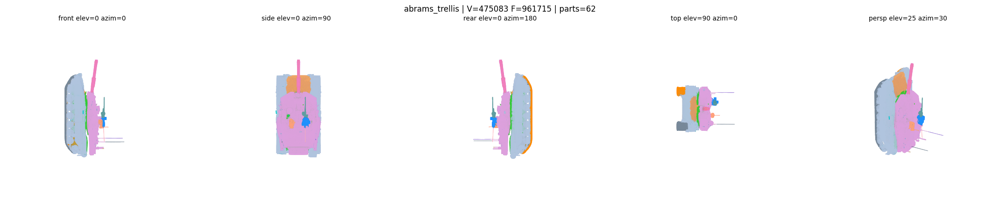
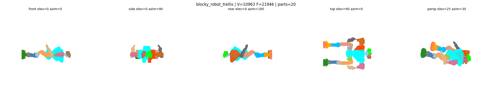
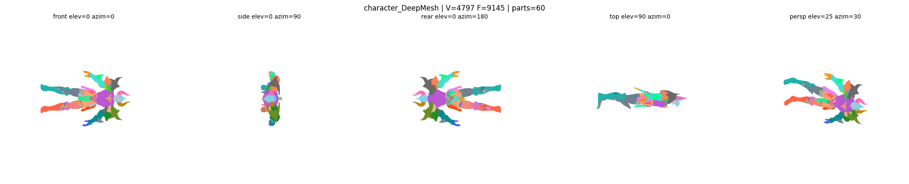
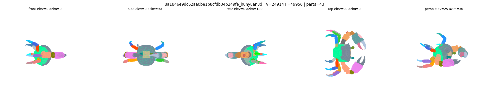
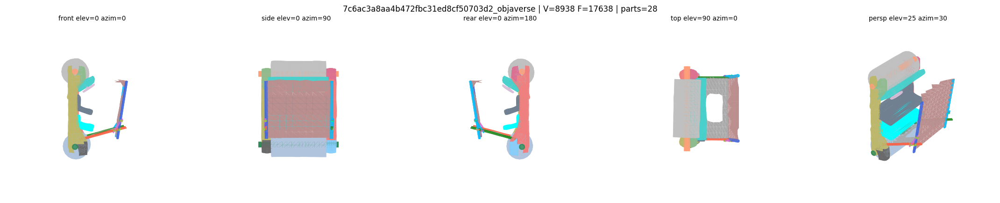
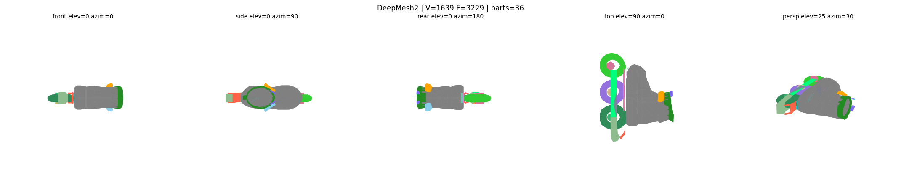
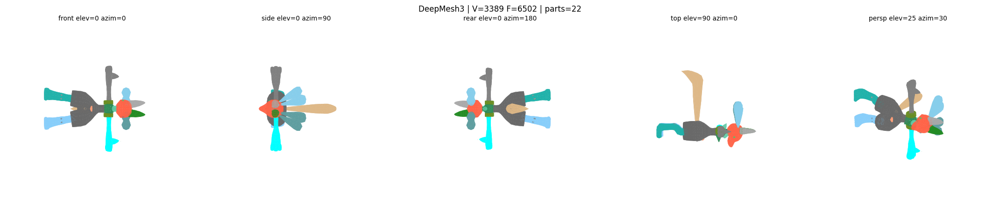
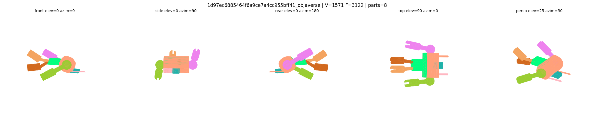

# PartSAM on AMD ROCm — first public port

> **Run [PartSAM](https://github.com/czvvd/PartSAM) (ICLR 2026, `arXiv:2509.21965`) — promptable 3D part segmentation — on consumer AMD GPUs (RDNA3 / RDNA4) with ROCm 7.x.**
>
> Officially CUDA-only. This recipe makes it work end-to-end on a Radeon AI PRO R9700 / RX 7900 XTX / RX 9070 XT.

[](#verified-hardware)
[](LICENSE)
[](#)
[](#)

---

## Featured: M1 Abrams tank — segmented in 65 s on R9700



*475 083 vertices, 961 715 faces, TRELLIS-generated. 9 functional parts auto-discovered: hull (lilac), turret (orange), cannon barrel (pink), tracks L+R (gray), front (blue), and detail clusters. PartSAM was trained primarily on organic + machinery objects yet still produces usable functional grouping for vehicles.*

---

## Gallery — 7 sample meshes from `data_eval/` (same `install.sh` produced all of these)

| Blocky robot (TRELLIS) — 20 parts | Character (DeepMesh) — 60 parts |
|---|---|
|  |  |
| **Hunyuan3D mesh — 43 parts** | **Objaverse mesh — multi-granularity** |
|  |  |
| **DeepMesh2 — 36 parts** | **DeepMesh3 — 22 parts** |
|  |  |
| **Objaverse mesh #2** |  |
|  |  |

Each PNG is a 5-view render (front / side / rear / top / persp) generated from the segmented `.ply` output. Per-face RGB encodes part labels. Open the `.ply` file in MeshLab, Blender, Open3D, or drag onto https://3dviewer.net/ for interactive inspection.

---

## Quick start

```bash
git clone https://github.com/<your-fork>/partsam-rocm
cd partsam-rocm
./scripts/install.sh        # idempotent ~25 min one-shot install on a fresh AMD machine

# After install completes:
cd /tmp/PartSAM
./run_rocm.sh               # → results/<mesh_name>.ply per input mesh
```

That's it. Drop your own `.glb` / `.obj` into `/tmp/PartSAM/data_eval/` and re-run `./run_rocm.sh`.

### Tunables:
```bash
BATCH=8 NUM_POINTS=50000 ./run_rocm.sh                 # higher quality, needs 32 GB VRAM
USE_GRAPH_CUT=True ./run_rocm.sh                       # sharper part boundaries (meshes <50 k faces only)
```

---

## Verified hardware

| GPU | Architecture | VRAM | ROCm | PyTorch | Status |
|---|---|---|---|---|---|
| **AMD Radeon AI PRO R9700** | gfx1201 (RDNA4) | 32 GB | 7.2.26015 | 2.11.0+rocm7.2 | ✅ verified — 8/8 meshes, 60 s/mesh |
| RX 9070 / 9070 XT | gfx1201 (RDNA4) | 16 GB | 7.x | 2.11+rocm7.2 | should work — same arch (use `BATCH=4 NUM_POINTS=10000`) |
| RX 7900 XTX / 7900 XT | gfx1100 (RDNA3) | 24 GB | 7.x | 2.11+rocm7.2 | should work — same code path, same patches |
| RX 7800 XT / 7700 XT | gfx1101 (RDNA3) | 16 GB | 7.x | 2.11+rocm7.2 | should work — reduce batch on smaller VRAM |
| RX 7600 | gfx1102 (RDNA3) | 8 GB | 7.x | 2.11+rocm7.2 | tight on VRAM — use smallest meshes, `NUM_POINTS=5000` |

If you've reproduced this on different hardware, please open a PR adding to this table.

---

## Why this exists

> The recon search for any prior ROCm port of these tools came up empty. Of the four CUDA-only 3D part-segmentation models surveyed (`SAMPart3D`, `HoloPart`, `MagicArticulate`, `PartSAM`), **none had public AMD/ROCm forks**, no working HuggingFace AMD Spaces, no ROCm/composable_kernel roadmap mention, no Reddit/blog tutorials. Researchers publish CUDA, move on, and the AMD ML community is too small to maintain forks. This is the first public PartSAM-on-ROCm.

The blockers were:

| Layer | Default | Why it fails on ROCm | Fix in this recipe |
|---|---|---|---|
| `pytorch_cluster` | CUDA wheel index, no ROCm whl | only NVIDIA precompiled binaries | use [Mateusz-Dera/pytorch_cluster_rocm](https://github.com/Mateusz-Dera/pytorch_cluster_rocm) auto-hipified fork |
| `torch_scatter` | CUDA wheel index | no ROCm precompiled wheels | source build with `FORCE_CUDA=1` (PyTorch+ROCm dispatches to HIP toolchain) |
| `pointops` | from SAMPart3D, CUDA-only | custom CUDA kernels for sparse point ops | source build with `FORCE_CUDA=1` |
| `torkit3d` | from Point-SAM, CUDA-only | same | source build with `FORCE_CUDA=1` |
| `apex` | NVIDIA-only | mixed precision, fused kernels | use [ROCm/apex](https://github.com/ROCm/apex) fork (cpp_ext only) |
| **`apex.FusedLayerNorm`** | needed by encoder | `fused_layer_norm_cuda.forward_affine` **hangs forever** on gfx1201 for PartSAM input shapes | monkey-patched to stock `torch.nn.LayerNorm` |
| **`torch.nn.LayerNorm`** | needed after fallback | stock `F.layer_norm` ATen kernel **also hangs** on these shapes | monkey-patched to manual Python implementation |
| **MIOpen Conv3d** | default direct/winograd | `MIOpen Error: stoul` parsing crash on certain Conv3d shapes | env: `MIOPEN_DEBUG_CONV_GEMM=1` + disable direct/winograd |
| `igraph._st_mincut` graph cut | default `use_graph_cut=True` | hangs on large meshes (>50 k faces) | flag `eval_params.use_graph_cut=False` for meshes >50 k faces |

All of the above are wrapped into a single `install.sh` and one Python patch (`patches/partsam_patch.py`).

### Required env (set automatically by `run_rocm.sh`):
```bash
export HSA_XNACK=1
export MIOPEN_DEBUG_CONV_GEMM=1
export MIOPEN_DEBUG_CONV_DIRECT=0
export MIOPEN_DEBUG_CONV_WINOGRAD=0
export MIOPEN_DEBUG_CONV_IMPLICIT_GEMM=1
export MIOPEN_USER_DB_PATH=/tmp/miopen_db
export MIOPEN_SYSTEM_DB_PATH=/tmp/miopen_db
export PYTORCH_HIP_ALLOC_CONF=garbage_collection_threshold:0.6,max_split_size_mb:128
```

---

## Performance baseline (R9700, gfx1201, ROCm 7.2)

```
Evaluating: 100%|██████████| 8/8 [08:00<00:00, 60.00s/it]
```

| Stage | Time |
|---|---|
| First mesh (cold MIOpen autotune) | ~84 s |
| Subsequent meshes (warm cache) | ~57–69 s |
| **Average** | **60 s/mesh** |
| Abrams tank (475 k V / 962 k F, no graph_cut) | 65 s |

VRAM peak: 32 GB at default `BATCH=32, NUM_POINTS=100000`. For 16 GB cards: `BATCH=4 NUM_POINTS=10000` (verified).

**Performance honesty:** ~3× slower than reported NVIDIA A100 numbers (paper: ~20 s/mesh). The Python LayerNorm fallback is the dominant overhead. If anyone writes a working ROCm `layer_norm` kernel for these shapes (Triton or HIP), this would close most of the gap — PR welcome.

---

## Output format

Each input mesh produces a single `.ply` file in `results/` with per-face RGB colors:

```python
import trimesh, numpy as np
m = trimesh.load("results/blocky_robot_trellis.ply", process=False)
fc = np.asarray(m.visual.face_colors)[:, :3]
unique_parts = np.unique(fc.reshape(-1, 3), axis=0)
print(f"{len(unique_parts)} parts")  # → 20

# Filter only one part (e.g. cannon barrel) by color match
mask = (fc == unique_parts[0]).all(axis=-1)
submesh = m.submesh([np.where(mask)[0]], append=True)
submesh.export("part_0.ply")
```

---

## Files in this repo

```
partsam-rocm/
├── README.md                      # this file
├── LICENSE                        # MIT
├── scripts/
│   └── install.sh                 # one-shot installer (idempotent, ~25 min on fresh machine)
├── patches/
│   └── partsam_patch.py           # apex stubs + manual LayerNorm.forward (ROCm-safe)
└── examples/                      # 8× 5-view PNG renders of segmentation results
    ├── abrams_trellis_5view.png
    ├── blocky_robot_trellis_5view.png
    ├── character_DeepMesh_5view.png
    ├── 8a1846…_hunyuan3d_5view.png
    ├── 7c6ac3…_objaverse_5view.png
    ├── 1d97ec…_objaverse_5view.png
    ├── DeepMesh2_5view.png
    └── DeepMesh3_5view.png
```

---

## Known limitations

1. **Apex `FusedLayerNorm` and stock `F.layer_norm` both hang on ROCm gfx1201 for PartSAM shapes.** Patch replaces both with manual Python (~3× slower than a working CUDA fused kernel).
2. **MIOpen Conv3d direct/winograd modes hang.** Required env flags force GEMM/implicit-GEMM only.
3. **`use_graph_cut=True` hangs on meshes >50 k faces** (igraph `_st_mincut` is CPU-only and scales poorly). Default flipped to `False` in `run_rocm.sh`.
4. **Training code not yet released by upstream.** Inference only.
5. **PartSAM was not specifically trained on vehicles** — segmentation of pure mechanical objects (tanks, cars without wheels visible separately) gives functional grouping but with some boundary artifacts. Better suited for organic + characters + machinery with limbs.

---

## Acknowledgements

- Original PartSAM authors: Zhe Zhu, Le Wan, Rui Xu, Yiheng Zhang, Honghua Chen, Zhiyang Dou, Cheng Lin, Yuan Liu, Mingqiang Wei (NUAA + collaborators), [paper (ICLR 2026)](https://arxiv.org/abs/2509.21965), [code](https://github.com/czvvd/PartSAM), [weights on HF](https://huggingface.co/Czvvd/PartSAM).
- `pytorch_cluster_rocm` fork: [@Mateusz-Dera](https://github.com/Mateusz-Dera/pytorch_cluster_rocm).
- ROCm `apex` fork: [ROCm/apex](https://github.com/ROCm/apex).
- The same `FORCE_CUDA=1 → HIP toolchain` trick that unblocks the four native CUDA extensions also unblocks HoloPart, SAMPart3D's pointops, and others — please reuse.

## License

MIT for everything in this repo. Upstream PartSAM has its own license — see [czvvd/PartSAM/LICENSE](https://github.com/czvvd/PartSAM/blob/main/LICENSE.txt).

---

## Contributing

If you got this running on different ROCm/PyTorch/GPU combinations, **PR welcome** — add to the verified hardware table and report the workflow that worked. If something hangs in a different way, open an issue with `py-spy dump` output of the stuck process — that's how we found the apex+LayerNorm bugs.

## Contact

Discord: **mat#6734**
